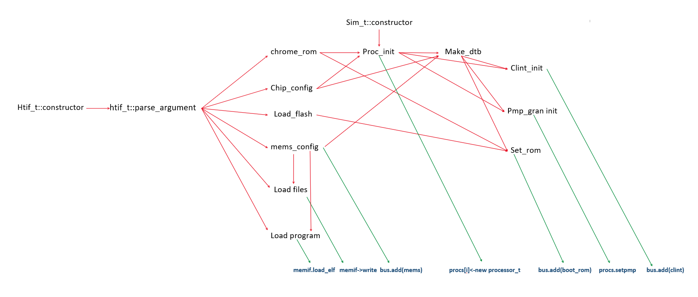

VFSpike: A Modified Spike for Verified Firmware
==================================

#### Email: yucheng_chen@qq.com

## Intro 

Modifications of VFSpike are based on https://github.com/riscv/riscv-isa-sim/tree/master/riscv to make a customized spike to run the Verified Firmware. Please view basic info about spike at that github site README.md. This README.md only contains info relevant to modifications made to the original spike. 

## Motivation

The original spike can't meet the demand to run verified firmware commands:

```shell
./spike --pc=0x93000000 -m0x90000000:0x10000000,0x80000000:0x20000000 ++/home/yuchengchen/vf/device/sw/bbl/build/bbl0 ++load_rom ++chrome_rom ++load_files=/home/yuchengchen/vf/keys/root_key.vbpubk__0x95600000,/home/yuchengchen/vf/keys/firmware.vblock__0x95601000,/home/yuchengchen/vf/device/sw/bbl/build/bbl1__0x95603000,/home/yuchengchen/vf/keys/firmware_v2.vblock__0x95701000,/home/yuchengchen/vf/device/sw/bbl/build/bbl1__0x95703000,/home/yuchengchen/vf/device/sw/lib/gptk.bin__0x90000000  ++chip_config=nc_1__f_1000__xlen_64__isa_rv64imafdc  ++shift_file= ++mems=0x90000000:0x10000000,0x80000000:0x20000000 ++load_flash=0x93000000
```

Specifically speaking, verified firmware **demand** following  3 customized functionality to run command above:

| Demand                                                       | Relevant Module | Dependency                                 |
| ------------------------------------------------------------ | --------------- | ------------------------------------------ |
| (1). Write Verified File (i.e. root_key.vbpubk) to Certain Memory Address | htif_t          | Memory Interface(Mem IF), HTIF Parser      |
| (2). Customized dtb                                          | sim_t, htif_t   | Chip Config Parser, Processor Info, Mem IF |
| (3). Customized ROM                                          | sim_t,htif_t    | Customized dtb, start_pc, rstvec           |

We can decouple the original spike modules, then regroup them with our new modules. To implement the VFSpike, we use 11 modules and they are organized with certain order by the dependency.


## Implementation

Here we list the 11 module and its functionality. 

| Name          | Functionality                                                | Module |
| ------------- | ------------------------------------------------------------ | ------ |
| chrome_rom    | Deal with ++chrome_rom. If this flag on, set reset vector to certain encoded value. | HTIF_T |
| chip_config   | Deal with ++chip_config. Follow with a string. Parse the string and extract relevant info to init processors and dtb. | HTIF_T |
| load_flash    | Deal with ++load_flash. Follow with a integer and set  the start_pc to that integer | HTIF_T |
| mems_config   | Deal with ++mems. Parse the memory configuration string and initialize the mem_t, then add the mem_t to bus. Note that "-m" is ignored if ++mems exists. If use -m flag only, Demand (1). will fail, which is not recommended. | HTIF_T |
| load_file     | Deal with ++load_files. Follow with a string with format: file1\_\_addr1,file2\_\_addr2,...,fileN\_\_addrN. It will read each file and write the whole binary to each corresponding addr. | HTIF_T |
| load_program  | Deal with ++filename, which is an elf file. htif_t::load_program() is call to read the file. The shift_file value will be added to the original addr in elf if that elf is bbl0. | HTIF_T |
| proc_init     | This is a internal function. Which take information from chip_config and chrome_rom to initialize the processors. But due to the derive relationship of classes. proc_init is limit to put at sim_t. So, all module depending to proc_init must be put at sim_t. | SIM_T  |
| make_dtb      | Take the chips/mems/procs info to generate dts, and use dts to build dtb. | SIM_T  |
| Clint_init    | Take dtb string to initialize the interrupt services.        | SIM_T  |
| pmp_gran init | Further initialize the procs vector by dtb string.           | SIM_T  |
| set_rom       | Use the customized dtb / start_pc /  rstvec to build customized rom and write to the bus. | SIM_T  |

#### Module Input Output 

| Name         | In                       | Out                           |
| ------------ | ------------------------ | ----------------------------- |
| chrome_rom   | **USER ++chrome**        | rstvec                        |
| chip_config  | **USER ++chip_config=**  | proc_num,frequency,isa_string |
| mems_config  | **USER ++mems=**         | **mems,bus.add(mems)**        |
| load_flash   | **USER ++load_flash**    | start_pc                      |
| load_program | **USER ++filename**      | **memif->write(elf)**         |
| load_file    | **USER ++load_files=**   | **memif->write(files)**       |
| proc_init    | rstvec,isa,proc_num,mems | **procs**                     |
| make_dtb     | procs,frequency,         | dtb // string                 |
| clint_init   | dtb,procs,frequency      | **bus.add(clint)**            |
| pmp_ran_init | dtb,procs                | **procs.set_pmp()**           |
| set_rom      | start_pc,rstvec,dtb      | **bus.add(boot_rom)**         |

Bolden texts are output that influence the latter simulator execution or input need outside influence. Normal texts are internal information.



This graph, red arrow mean dependency. Green arrow means external output. 


## Appendix: Running Log

~~~~shell
./build/spike -d --pc=0x93000000  ++/home/yuchengchen/vfbackup/vf/keys/bbl0 ++load_rom ++load_files=/home/yuchengchen/vfbackup/vf/keys/root_key.vbpubk__0x95600000,/home/yuchengchen/vfbackup/vf/keys/firmware.vblock__0x95601000,/home/yuchengchen/vfbackup/vf/keys/bbl1__0x95603000,/home/yuchengchen/vfbackup/vf/keys/firmware_v2.vblock__0x95701000,/home/yuchengchen/vfbackup/vf/keys/bbl1__0x95703000,/home/yuchengchen/vfbackup/vf/device/sw/lib/gptk.bin__0x90000000  ++chip_config=nc_1__f_1000000000__xlen_64__isa_rv64imafdc  ++shift_file=0x13000000 ++mems=0x90000000:0x10000000,0x80000000:0x20000000 ++load_flash=0x93000000 
SPIKEMAIN_make_mems
    mb=800,p=
initialuze a mems:(size:0x80000000)
############chrome_rom start############
    rstvec <- 0x800d0000, committed
############chrome_rom end############

############chip config start############
    argmap[chip_config]=nc_1__f_1000000000__xlen_64__isa_rv64imafdc
        underline_separte src=nc_1__f_1000000000__xlen_64__isa_rv64imafdc
        underline_separte result:"nc_1","f_1000000000__xlen_64__isa_rv64imafdc"
        ret1=nc_1,ret2=f_1000000000__xlen_64__isa_rv64imafdc
        flag=0,i=6
        tmpsub=nc_1
  pair_first=nc,pair_second=1
    cpu_num <- 1
        underline_separte src=f_1000000000__xlen_64__isa_rv64imafdc
        underline_separte result:"f_1000000000","xlen_64__isa_rv64imafdc"
        ret1=f_1000000000,ret2=xlen_64__isa_rv64imafdc
        flag=0,i=20
        tmpsub=f_1000000000
  pair_first=f,pair_second=1000000000
    freq <- 1000000000
        underline_separte src=xlen_64__isa_rv64imafdc
        underline_separte result:"xlen_64","isa_rv64imafdc"
        ret1=xlen_64,ret2=isa_rv64imafdc
        flag=0,i=29
        tmpsub=xlen_64
  pair_first=xlen,pair_second=64
        underline_separte src=isa_rv64imafdc
underline_separate no find __ indicator
        ret1=isa_rv64imafdc,ret2=
        flag=1,i=45
        tmpsub=isa_rv64imafdc
  pair_first=isa,pair_second=rv64imafdc
    htif_isa <- rv64imafdc
commit result:
    cpu_num=1,freq=1000000000,htif_isa=rv64imafdc
chip_config end---
############mems_config start############
helper_make_mems
        mb=80000000,p=:0x20000000
        res.push_back(80000000,(mem_t(536870912)))
initialuze a mems:(size:0x20000000)
detecter mems final first:0x80000000,memsize=0x20000000
​~~~~add_device start~~~~
    addr=0x80000000,dev=0x7fffd0ccab90
​~~~~add_device end~~~
        htifmems :commit bus.add_device 80000000,(20000000,)
############mems_config end############

############make_flash_addr start############
    start_pc <- 93000000, committed
#############make_flash_addr end############

​~~~~add_device start~~~~
    addr=0x0,dev=0x7fffd7f511a8
​~~~~add_device end~~~
############init_procs start############
    hartids=
    isa=rv64imafdc,priv=MSU,varch=vlen:128,elen:64,slen:128,halted=0
############init proc end############

############make_dtb start############
    INSNS_P_R_T=100,freq=1000000000,initrd_start=0,initrd_end=0
    bootargs=(null)
    procs.pc=2148335616
    htif_mems=reg_t : 2147483648(20000000,)
    dts=/dts-v1/;

/ {
  #address-cells = <2>;
  #size-cells = <2>;
  compatible = "ucbbar,spike-bare-dev";
  model = "ucbbar,spike-bare";
  chosen {
    bootargs = "console=hvc0 earlycon=sbi";
  };
  cpus {
    #address-cells = <1>;
    #size-cells = <0>;
    timebase-frequency = <10000000>;
    CPU0: cpu@0 {
      device_type = "cpu";
      reg = <0>;
      status = "okay";
      compatible = "riscv";
      riscv,isa = "rv64imafdc";
      mmu-type = "riscv,sv48";
      riscv,pmpregions = <16>;
      riscv,pmpgranularity = <4>;
      clock-frequency = <1000000000>;
      CPU0_intc: interrupt-controller {
        #interrupt-cells = <1>;
        interrupt-controller;
        compatible = "riscv,cpu-intc";
      };
    };
  };
  memory@80000000 {
    device_type = "memory";
    reg = <0x0 0x80000000 0x0 0x20000000>;
  };
  soc {
    #address-cells = <2>;
    #size-cells = <2>;
    compatible = "ucbbar,spike-bare-soc", "simple-bus";
    ranges;
    clint@2000000 {
      compatible = "riscv,clint0";
      interrupts-extended = <&CPU0_intc 3 &CPU0_intc 7 >;
      reg = <0x0 0x2000000 0x0 0xc0000>;
    };
  };
  htif {
    compatible = "ucb,htif0";
  };
};
,size=1161
,size=1145
############make_dtb end############

############clint_t init start############
​~~~~add_device start~~~~
    addr=0x2000000,dev=0x7fffd0d24640
​~~~~add_device end~~~
############clint_t init end############

############pmp init start############
    i:0,set_pmp_num:16,set_pmp_gran:4
############pmp init end############

############load_file start############
    comma_separate input src=/home/yuchengchen/vfbackup/vf/keys/root_key.vbpubk__0x95600000,/home/yuchengchen/vfbackup/vf/keys/firmware.vblock__0x95601000,/home/yuchengchen/vfbackup/vf/keys/bbl1__0x95603000,/home/yuchengchen/vfbackup/vf/keys/firmware_v2.vblock__0x95701000,/home/yuchengchen/vfbackup/vf/keys/bbl1__0x95703000,/home/yuchengchen/vfbackup/vf/device/sw/lib/gptk.bin__0x90000000
    comma separate output dst=
      /home/yuchengchen/vfbackup/vf/keys/root_key.vbpubk__0x95600000,
      /home/yuchengchen/vfbackup/vf/keys/firmware.vblock__0x95601000,
      /home/yuchengchen/vfbackup/vf/keys/bbl1__0x95603000,
      /home/yuchengchen/vfbackup/vf/keys/firmware_v2.vblock__0x95701000,
      /home/yuchengchen/vfbackup/vf/keys/bbl1__0x95703000,
      /home/yuchengchen/vfbackup/vf/device/sw/lib/gptk.bin__0x90000000,
        underline_separte src=/home/yuchengchen/vfbackup/vf/keys/root_key.vbpubk__0x95600000
        underline_separte result:"/home/yuchengchen/vfbackup/vf/keys/root_key.vbpubk","0x95600000"
        now openfile fn=/home/yuchengchen/vfbackup/vf/keys/root_key.vbpubk
        openfile end, filesize=2088
    s=/home/yuchengchen/vfbackup/vf/keys/root_key.vbpubk__0x95600000
    mem.write(addr=0x95600000,fsize=2088,bin.get()=0x7f8cbe113000)
    mem.write committed######
        underline_separte src=/home/yuchengchen/vfbackup/vf/keys/firmware.vblock__0x95601000
        underline_separte result:"/home/yuchengchen/vfbackup/vf/keys/firmware.vblock","0x95601000"
        now openfile fn=/home/yuchengchen/vfbackup/vf/keys/firmware.vblock
        openfile end, filesize=4396
    s=/home/yuchengchen/vfbackup/vf/keys/firmware.vblock__0x95601000
    mem.write(addr=0x95601000,fsize=4396,bin.get()=0x7f8cbe112000)
    mem.write committed######
        underline_separte src=/home/yuchengchen/vfbackup/vf/keys/bbl1__0x95603000
        underline_separte result:"/home/yuchengchen/vfbackup/vf/keys/bbl1","0x95603000"
        now openfile fn=/home/yuchengchen/vfbackup/vf/keys/bbl1
        openfile end, filesize=516168
    s=/home/yuchengchen/vfbackup/vf/keys/bbl1__0x95603000
    mem.write(addr=0x95603000,fsize=516168,bin.get()=0x7f8cbdfaa000)
    mem.write committed######
        underline_separte src=/home/yuchengchen/vfbackup/vf/keys/firmware_v2.vblock__0x95701000
        underline_separte result:"/home/yuchengchen/vfbackup/vf/keys/firmware_v2.vblock","0x95701000"
        now openfile fn=/home/yuchengchen/vfbackup/vf/keys/firmware_v2.vblock
        openfile end, filesize=4396
    s=/home/yuchengchen/vfbackup/vf/keys/firmware_v2.vblock__0x95701000
    mem.write(addr=0x95701000,fsize=4396,bin.get()=0x7f8cbe112000)
    mem.write committed######
        underline_separte src=/home/yuchengchen/vfbackup/vf/keys/bbl1__0x95703000
        underline_separte result:"/home/yuchengchen/vfbackup/vf/keys/bbl1","0x95703000"
        now openfile fn=/home/yuchengchen/vfbackup/vf/keys/bbl1
        openfile end, filesize=516168
    s=/home/yuchengchen/vfbackup/vf/keys/bbl1__0x95703000
    mem.write(addr=0x95703000,fsize=516168,bin.get()=0x7f8cbdfaa000)
    mem.write committed######
        underline_separte src=/home/yuchengchen/vfbackup/vf/device/sw/lib/gptk.bin__0x90000000
        underline_separte result:"/home/yuchengchen/vfbackup/vf/device/sw/lib/gptk.bin","0x90000000"
        now openfile fn=/home/yuchengchen/vfbackup/vf/device/sw/lib/gptk.bin
        openfile end, filesize=42619392
    s=/home/yuchengchen/vfbackup/vf/device/sw/lib/gptk.bin__0x90000000
    mem.write(addr=0x90000000,fsize=42619392,bin.get()=0x7f8c1a3ba000)
    mem.write committed######
############load_file end############


############load program start############
    bbl0 recognizer /home/yuchengchen/vfbackup/vf/keys/bbl0
    loading bbl0, shift_value=0x13000000
    ############load_elf start#############
        ph[0].p_filesz:0x172b8,paddr:0x80000000,shift:0x13000000,final_addr:0x93000000
        zerosize:0x0
        ph[1].p_filesz:0x10c4,paddr:0x80018000,shift:0x13000000,final_addr:0x93018000
        zerosize:0xa853c
    ############load_elf end#############
############load program end############

############make_rom start############
add reset_vec to rom:

     297  2028593 f1402573  182b283
   28067        0 93000000        0
|||
add dtb to rom:
     297  2028593 f1402573  182b283
   28067        0 93000000        0
edfe0dd0 79040000 38000000 88030000
28000000 11000000 10000000        0
f1000000 50030000        0        0
       0        0  1000000        0
 3000000  4000000        0  2000000
 3000000  4000000  f000000  2000000
 3000000 16000000 1b000000 62626375
732c7261 656b6970 7261622d 65642d65
      76  3000000 12000000 26000000
62626375 732c7261 656b6970 7261622d
      65  1000000 736f6863     6e65
 3000000 1a000000 2c000000 736e6f63
3d656c6f 30637668 72616520 6f63796c
62733d6e       69  2000000  1000000
73757063        0  3000000  4000000
       0  1000000  3000000  4000000
 f000000        0  3000000  4000000
35000000 80969800  1000000 40757063
      30  3000000  4000000 48000000
  757063  3000000  4000000 54000000
       0  3000000  5000000 58000000
79616b6f        0  3000000  6000000
1b000000 63736972       76  3000000
 b000000 5f000000 34367672 66616d69
    6364  3000000  b000000 69000000
63736972 76732c76     3834  3000000
 4000000 72000000 10000000  3000000
 4000000 83000000  4000000  3000000
 4000000 98000000   ca9a3b  1000000
65746e69 70757272 6f632d74 6f72746e
72656c6c        0  3000000  4000000
a8000000  1000000  3000000        0
b9000000  3000000  f000000 1b000000
63736972 70632c76 6e692d75     6374
 3000000  4000000 ce000000  1000000
 2000000  2000000  2000000  1000000
6f6d656d 38407972 30303030   303030
 3000000  7000000 48000000 6f6d656d
    7972  3000000 10000000 54000000
       0       80        0       20
 2000000  1000000   636f73  3000000
 4000000        0  2000000  3000000
 4000000  f000000  2000000  3000000
21000000 1b000000 62626375 732c7261
656b6970 7261622d 6f732d65 69730063
656c706d 7375622d        0  3000000
       0 d6000000  1000000 6e696c63
30324074 30303030       30  3000000
 d000000 1b000000 63736972 6c632c76
30746e69        0  3000000 10000000
dd000000  1000000  3000000  1000000
 7000000  3000000 10000000 54000000
       0        2        0      c00
 2000000  2000000  1000000 66697468
       0  3000000  a000000 1b000000
2c626375 66697468       30  2000000
 2000000  9000000 64646123 73736572
6c65632d 2300736c 657a6973 6c65632d
6300736c 61706d6f 6c626974 6f6d0065
  6c6564 746f6f62 73677261 6d697400
73616265 72662d65 65757165   79636e
69766564 745f6563   657079   676572
74617473 72007375 76637369 6173692c
756d6d00 7079742d 69720065 2c766373
72706d70 6f696765 7200736e 76637369
706d702c 6e617267 72616c75   797469
636f6c63 72662d6b 65757165   79636e
746e6923 75727265 632d7470 736c6c65
746e6900 75727265 632d7470 72746e6f
656c6c6f 68700072 6c646e61 61720065
7365676e 746e6900 75727265 2d737470
65747865 6465646e        0 |||
add align to rom:
     297  2028593 f1402573  182b283
   28067        0 93000000        0
edfe0dd0 79040000 38000000 88030000
28000000 11000000 10000000        0
f1000000 50030000        0        0
       0        0  1000000        0
 3000000  4000000        0  2000000
 3000000  4000000  f000000  2000000
 3000000 16000000 1b000000 62626375
732c7261 656b6970 7261622d 65642d65
      76  3000000 12000000 26000000
62626375 732c7261 656b6970 7261622d
      65  1000000 736f6863     6e65
 3000000 1a000000 2c000000 736e6f63
3d656c6f 30637668 72616520 6f63796c
62733d6e       69  2000000  1000000
73757063        0  3000000  4000000
       0  1000000  3000000  4000000
 f000000        0  3000000  4000000
35000000 80969800  1000000 40757063
      30  3000000  4000000 48000000
  757063  3000000  4000000 54000000
       0  3000000  5000000 58000000
79616b6f        0  3000000  6000000
1b000000 63736972       76  3000000
 b000000 5f000000 34367672 66616d69
    6364  3000000  b000000 69000000
63736972 76732c76     3834  3000000
 4000000 72000000 10000000  3000000
 4000000 83000000  4000000  3000000
 4000000 98000000   ca9a3b  1000000
65746e69 70757272 6f632d74 6f72746e
72656c6c        0  3000000  4000000
a8000000  1000000  3000000        0
b9000000  3000000  f000000 1b000000
63736972 70632c76 6e692d75     6374
 3000000  4000000 ce000000  1000000
 2000000  2000000  2000000  1000000
6f6d656d 38407972 30303030   303030
 3000000  7000000 48000000 6f6d656d
    7972  3000000 10000000 54000000
       0       80        0       20
 2000000  1000000   636f73  3000000
 4000000        0  2000000  3000000
 4000000  f000000  2000000  3000000
21000000 1b000000 62626375 732c7261
656b6970 7261622d 6f732d65 69730063
656c706d 7375622d        0  3000000
       0 d6000000  1000000 6e696c63
30324074 30303030       30  3000000
 d000000 1b000000 63736972 6c632c76
30746e69        0  3000000 10000000
dd000000  1000000  3000000  1000000
 7000000  3000000 10000000 54000000
       0        2        0      c00
 2000000  2000000  1000000 66697468
       0  3000000  a000000 1b000000
2c626375 66697468       30  2000000
 2000000  9000000 64646123 73736572
6c65632d 2300736c 657a6973 6c65632d
6300736c 61706d6f 6c626974 6f6d0065
  6c6564 746f6f62 73677261 6d697400
73616265 72662d65 65757165   79636e
69766564 745f6563   657079   676572
74617473 72007375 76637369 6173692c
756d6d00 7079742d 69720065 2c766373
72706d70 6f696765 7200736e 76637369
706d702c 6e617267 72616c75   797469
636f6c63 72662d6b 65757165   79636e
746e6923 75727265 632d7470 736c6c65
746e6900 75727265 632d7470 72746e6f
656c6c6f 68700072 6c646e61 61720065
7365676e 746e6900 75727265 2d737470
65747865 6465646e        0        0
       0        0        0        0
       0        0        0        0
       0        0        0        0
       0        0        0        0
       0        0        0        0
       0        0        0        0
       0        0        0        0
       0        0        0        0
       0        0        0        0
       0        0        0        0
       0        0        0        0
       0        0        0        0
       0        0        0        0
       0        0        0        0
       0        0        0        0
       0        0        0        0
       0        0        0        0
       0        0        0        0
       0        0        0        0
       0        0        0        0
       0        0        0        0
       0        0        0        0
       0        0        0        0
       0        0        0        0
       0        0        0        0
       0        0        0        0
       0        0        0        0
       0        0        0        0
       0        0        0        0
       0        0        0        0
       0        0        0        0
       0        0        0        0
       0        0        0        0
       0        0        0        0
       0        0        0        0
       0        0        0        0
       0        0        0        0
       0        0        0        0
       0        0        0        0
       0        0        0        0
       0        0        0        0
       0        0        0        0
       0        0        0        0
       0        0        0        0
       0        0        0        0
       0        0        0        0
       0        0        0        0
       0        0        0        0
       0        0        0        0
       0        0        0        0
       0        0        0        0
       0        0        0        0
       0        0        0        0
       0        0        0        0
       0        0        0        0
       0        0        0        0
       0        0        0        0
       0        0        0        0
       0        0        0        0
       0        0        0        0
       0        0        0        0
       0        0        0        0
       0        0        0        0
       0        0        0        0
       0        0        0        0
       0        0        0        0
       0        0        0        0
       0        0        0        0
       0        0        0        0
       0        0        0        0
       0        0        0        0
       0        0        0        0
       0        0        0        0
       0        0        0        0
       0        0        0        0
       0        0        0        0
       0        0        0        0
       0        0        0        0
       0        0        0        0
       0        0        0        0
       0        0        0        0
       0        0        0        0
       0        0        0        0
       0        0        0        0
       0        0        0        0
       0        0        0        0
       0        0        0        0
       0        0        0        0
       0        0        0        0
       0        0        0        0
       0        0        0        0
       0        0        0        0
       0        0        0        0
       0        0        0        0
       0        0        0        0
       0        0        0        0
       0        0        0        0
       0        0        0        0
       0        0        0        0
       0        0        0        0
       0        0        0        0
       0        0        0        0
       0        0        0        0
       0        0        0        0
       0        0        0        0
       0        0        0        0
       0        0        0        0
       0        0        0        0
       0        0        0        0
       0        0        0        0
       0        0        0        0
       0        0        0        0
       0        0        0        0
       0        0        0        0
       0        0        0        0
       0        0        0        0
       0        0        0        0
       0        0        0        0
       0        0        0        0
       0        0        0        0
       0        0        0        0
       0        0        0        0
       0        0        0        0
       0        0        0        0
       0        0        0        0
       0        0        0        0
       0        0        0        0
       0        0        0        0
       0        0        0        0
       0        0        0        0
       0        0        0        0
       0        0        0        0
       0        0        0        0
       0        0        0        0
       0        0        0        0
       0        0        0        0
       0        0        0        0
       0        0        0        0
       0        0        0        0
       0        0        0        0
       0        0        0        0
       0        0        0        0
       0        0        0        0
       0        0        0        0
       0        0        0        0
       0        0        0        0
       0        0        0        0
       0        0        0        0
       0        0        0        0
       0        0        0        0
       0        0        0        0
       0        0        0        0
       0        0        0        0
       0        0        0        0
       0        0        0        0
       0        0        0        0
       0        0        0        0
       0        0        0        0
       0        0        0        0
       0        0        0        0
       0        0        0        0
       0        0        0        0
       0        0        0        0
       0        0        0        0
       0        0        0        0
       0        0        0        0
       0        0        0        0
       0        0        0        0
       0        0        0        0
       0        0        0        0
       0        0        0        0
       0        0        0        0
       0        0        0        0
       0        0        0        0
       0        0        0        0
       0        0        0        0
       0        0        0        0
       0        0        0        0
       0        0        0        0
       0        0        0        0
       0        0        0        0
       0        0        0        0
|||
    commit result
    rstvec=0x800d0000,start_pc=0x93000000,boot_rom.get()=(nil),rom.size()=0x1000
############make_rom end ############

bbl loader
Setup memory protection
init
stage 1
stage 2
stage 3
stage 4
Verifying Firmware A
stage 5
Loading Firmware A
Jumping to Loaded Firmware
stage 6
kernel size to read 15790080 kernel destination 80fff000
Done vboot
[    0.000000] OF: fdt: Ignoring memory range 0x80000000 - 0x81000000
[    0.000000] Linux version 5.2.0 (root@ea9b93c5e564) (gcc version 8.3.0 (GCC)) #31 SMP Sun Nov 10 15:21:59 PST 2019
[    0.000000] earlycon: sbi0 at I/O port 0x0 (options '')
[    0.000000] printk: bootconsole [sbi0] enabled
[    0.000000] initrd not found or empty - disabling initrd
[    0.000000] Zone ranges:
[    0.000000]   DMA32    [mem 0x0000000081000000-0x000000008fffffff]
[    0.000000]   Normal   empty
[    0.000000] Movable zone start for each node
[    0.000000] Early memory node ranges
[    0.000000]   node   0: [mem 0x0000000081000000-0x000000008fffffff]
[    0.000000] Initmem setup node 0 [mem 0x0000000081000000-0x000000008fffffff]
[    0.000000] software IO TLB: mapped [mem 0x8bcb6000-0x8fcb6000] (64MB)
[    0.000000] elf_hwcap is 0x112d
[    0.000000] percpu: Embedded 16 pages/cpu s27608 r8192 d29736 u65536
[    0.000000] Built 1 zonelists, mobility grouping on.  Total pages: 60600
[    0.000000] Kernel command line: console=hvc0 earlycon=sbi
[    0.000000] Dentry cache hash table entries: 32768 (order: 6, 262144 bytes)
[    0.000000] Inode-cache hash table entries: 16384 (order: 5, 131072 bytes)
[    0.000000] Sorting __ex_table...
[    0.000000] Memory: 161856K/245760K available (3686K kernel code, 173K rwdata, 891K rodata, 8666K init, 730K bss, 83904K reserved, 0K cma-reserved)
[    0.000000] SLUB: HWalign=64, Order=0-3, MinObjects=0, CPUs=1, Nodes=1
[    0.000000] rcu: Hierarchical RCU implementation.
[    0.000000] rcu:     RCU restricting CPUs from NR_CPUS=8 to nr_cpu_ids=1.
[    0.000000] rcu: RCU calculated value of scheduler-enlistment delay is 25 jiffies.
[    0.000000] rcu: Adjusting geometry for rcu_fanout_leaf=16, nr_cpu_ids=1
[    0.000000] NR_IRQS: 0, nr_irqs: 0, preallocated irqs: 0
[    0.000000] riscv_timer_init_dt: Registering clocksource cpuid [0] hartid [0]
[    0.000000] clocksource: riscv_clocksource: mask: 0xffffffffffffffff max_cycles: 0x24e6a1710, max_idle_ns: 440795202120 ns
[    0.000005] sched_clock: 64 bits at 10MHz, resolution 100ns, wraps every 4398046511100ns
[    0.000490] printk: console [hvc0] enabled
[    0.000490] printk: console [hvc0] enabled
[    0.000965] printk: bootconsole [sbi0] disabled
[    0.000965] printk: bootconsole [sbi0] disabled
[    0.001500] Calibrating delay loop (skipped), value calculated using timer frequency.. 20.00 BogoMIPS (lpj=40000)
[    0.002100] pid_max: default: 32768 minimum: 301
[    0.002435] Mount-cache hash table entries: 512 (order: 0, 4096 bytes)
[    0.002815] Mountpoint-cache hash table entries: 512 (order: 0, 4096 bytes)
[    0.004035] rcu: Hierarchical SRCU implementation.
[    0.004550] smp: Bringing up secondary CPUs ...
[    0.004815] smp: Brought up 1 node, 1 CPU
[    0.005225] devtmpfs: initialized
[    0.005640] random: get_random_u32 called from bucket_table_alloc.isra.10+0x74/0x1fc with crng_init=0
[    0.006220] clocksource: jiffies: mask: 0xffffffff max_cycles: 0xffffffff, max_idle_ns: 7645041785100000 ns
[    0.006785] futex hash table entries: 256 (order: 2, 16384 bytes)
[    0.010280] SCSI subsystem initialized
[    0.010565] clocksource: Switched to clocksource riscv_clocksource
[    0.335100] workingset: timestamp_bits=62 max_order=16 bucket_order=0
[    0.339565] Block layer SCSI generic (bsg) driver version 0.4 loaded (major 254)
[    0.339995] io scheduler mq-deadline registered
[    0.340260] io scheduler kyber registered
[    0.360235] Serial: 8250/16550 driver, 4 ports, IRQ sharing disabled
[    0.363065] loop: module loaded
[    0.363345] mousedev: PS/2 mouse device common for all mice
[    0.366130] Freeing unused kernel memory: 8664K
[    0.366395] This architecture does not have kernel memory protection.
[    0.366815] Run /init as init process
Starting syslogd: OK
Starting klogd: OK
Starting mdev... OK
Initializing random number generator... [    0.547965] random: dd: uninitialized urandom read (512 bytes read)
done.
MMMMMMMMMMMMMMMMMMMMMMMMMMMMMMMMMMMMMMMMMMMMMMMMMMMMMMMMMMMM
MMMMMMMMMMMMMMMMMMMMMMMMMMMMMMMMMMMMMMMMMMMMMMMMMMMMMMMMMMMM
MMMMMMMMMMMMMMMWWWMMMMMWNX00XWMMMMMMMMMMMMMMMMMMMMMMMMMMMMMM
MMMMMMMMMMMMMN0dlkNMWN0xoc::xNMMMMMMMMMMMMMMMMMMMMMMMMMMMMMM
MMMMMMMMMMMWKo;,,;xKOo:;;;;;oKNNNXXXKKXXWMMMMMMMMMMMMMMMMMMM
MMMMWX0KNWW0c,,,,,;::;;;;;:cdOK00000000KWMMMMMMMMMMMMMMMMMMM
MMMMXxlldOkc,,,,,;;;;;;;:lddk000000000KNWMMMMMMMMMMMMMMMMMMM
MMMNklcccc:;,,,,,;;;;;:ldddxO00000000KXWMMMMMMMMMMMMMMMMMMMM
MMW0lccccc::;,,,;;;;;:ldddxk00000000KNWMMMMMMMMMMMMMMMMMMMMM
MMXxcccccc:::;,,;;;;:ldddxO0000000KXNMMMMMMMMMMMMMMMMMMMMMMM
MWKocccccc:::;,,;;;;codxkO00000KKXWWMMMMMMMMMMMMMMMMMMMMMMMM
MW0lcccccc:::;,,;;:cdO0KXXXXXNNWWMMMMMMMMMMMMMMMMMMMMMMMMMMM
MW0lccccccc:::;cdO0XNWMMMMMMMMMMMMMMMMMMMMMMMMMMMMMMMMMMMMMM
MW0occcccccccoOXWMMMMMMMMMMMMMMMMMMMMMMMMMMMMMMMMMMMMMMMMMMM
MMXdcccccccoONMMMMMMMMMMMMMMMMMMMMMMMMMMMMMMMMMMMMMMMMMMMMMM
MMNklccccco0WMMMMMMMMNXXXXXNWMMWXXNXXNWMMWXXNMWXXNWMMWXXWMMM
MMMXdcccclOWMMMMMMMMKc.';,..l0Ko.;d:.:KMXl':O0:..:KMXl.;0MMM
MMMW0occcdXMMMMMMMMNl  ,o;..co;. cO; ,0O,.:Od... .OWd. lNMMM
MMMMW0occxNMMMMMMMWk. ..  ,kO,  ,0X; 'c..oOc..:, .kO' ;KMMMM
MMMMMWKdldXMMMMMMMK, 'Ox. 'kc  .xWN:  .;kx'.';,. .o: .kMMMMM
MMMMMMWXkdOWMMMMMMKolOWXxldkxllkNMWOllxXXxlkXWNkldkdlkWMMMMM
MMMMMMMMWKOKWMMMMMMMMMMMMMMMMMMMMMMMMMMMMMMMMMMMMMMMMMMMMMMM
MMMMMMMMMMNXWMMMMMMMMMMMMMMMMMMMMMMMMMMMMMMMMMMMMMMMMMMMMMMM
MMMMMMMMMMMMMMMMMMMMMMMMMMMMMMMMMMMMMMMMMMMMMMMMMMMMMMMMMMMM
MMMMMMMMMMMMMMMMMMMMMMMMMMMMMMMMMMMMMMMMMMMMMMMMMMMMMMMMMMMM
MMMMMMMMMMMMMMMMMMMMMMMMMMMMMMMMMMMMMMMMMMMMMMMMMMMMMMMMMMMM


[    0.562205] vfdotp_no_depen[72]: unhandled signal 4 code 0x1 at 0x00000000000115c4 in vfdotp_no_dependencies_simulation_linux.elf[10000+70000]
[    0.563000] CPU: 0 PID: 72 Comm: vfdotp_no_depen Not tainted 5.2.0 #31
[    0.563380] sepc: 00000000000115c4 ra : 0000000000011894 sp : 0000003fffd18ca0
[    0.563800]  gp : 00000000000830f8 tp : 0000000000085700 t0 : 000000000000000a
[    0.564220]  t1 : 2f2f2f2f2f2f2f2f t2 : 0000000000000000 s0 : 0000003fffd18cc0
[    0.564640]  s1 : 0000000000011dfc a0 : 0000000000000001 a1 : 0000003fffd18da8
[    0.565060]  a2 : 0000003fffd18db8 a3 : 0000000000000000 a4 : 0000003fffd18ce8
[    0.565480]  a5 : 0000000000000020 a6 : 0000000000083268 a7 : 5d127d6a7c7a2f49
[    0.565900]  s2 : 0000000000000000 s3 : 00000000000c8670 s4 : 00000000000eb680
[    0.566320]  s5 : 0000000000000008 s6 : 00000015555797f0 s7 : ffffffffffffffff
[    0.566785]  s8 : 00000000000eb600 s9 : 0000000000000000 s10: 00000000000c7748
[    0.567205]  s11: 0000003ffffd3fb1 t3 : ffffffffffffffff t4 : 000000000000000c
[    0.567625]  t5 : 0000000000000047 t6 : 000000000000112d
[    0.567935] sstatus: 0000000200000020 sbadaddr: 000000006f079073 scause: 0000000000000002
Illegal instruction
# ls
ls
bin      init     linuxrc  opt      run      tmp
dev      lib      media    proc     sbin     usr
etc      lib64    mnt      root     sys      var
#

~~~~